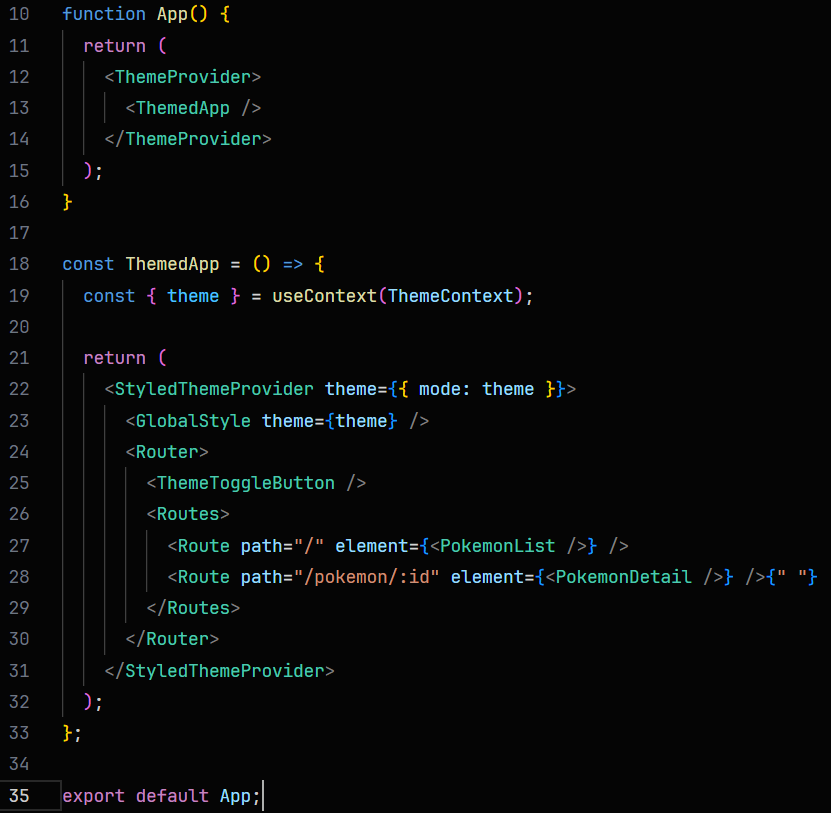

<h1>Quest React Avançado - DevQuest </h1>

Esta aplicação foi proposta pelo curso DevQuest

<ul>Onde os requisitos obrigatórios foram:</ul>
<li>A aplicação deverá ser Single Page Application (SPA);</li>
<li>Utilizar React.js para o desenvolvimento da
aplicação;</li>
<li>Utilizar Context API para criação do Theme Toggler
(Alternador entre tema claro e escuro);</li>
<li>Utilizar styled-components para estilização dos
componentes;</li>
<li>Utilizar react-router-dom para a navegação entre as
páginas;</li>

<h3>Dificuldades e desafios</h3>

Minha maior dificuldades foi na hora de implementar o Dark and Ligth mode, pois o não estava conseguindo fazer o GloblalStyle "pegar" o valor atual do 'theme', então a solução que tive após muita pesquisa foi a seguinte:

